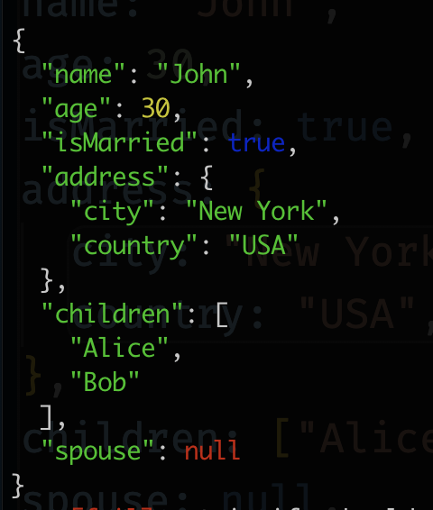

# giveit

Debug with ease any nested objects, arrays, etc. **giveit** is a `JSON.stringify` wrapper to display nested objects with indentation & color for quick debugging

## Installation

```console
npm install giveit
```

## Usage

```typescript
import { stringify } from "giveit";

const arrObj = [
  {
    name: "John Doe",
    age: 30,
    city: "New York",
    hobbies: ["reading", "cooking"],
    married: false,
    address: {
      street: "123 Main St",
      zip: 12345,
    },
  },
];

// give it! stringify will nicely show arrObj
console.log(stringify(arrObj));
```



## Author

[Pierre-Henry Soria ツ](https://ph7.me) – A [super passionate](https://github.com/pH-7) and enthusiastic Problem-Solver / Senior Software Engineer living currently in Sydney 🦘

Also, a true cheese 🧀, ristretto ☕️, and dark chocolate lover! 😋 👉 Reach me on [https://www.linkedin.com/in/ph7enry/](LinkedIn) ⚡️

## License

Distributed under the _[MIT](https://opensource.org/licenses/MIT)_ 🎉 Enjoy!
